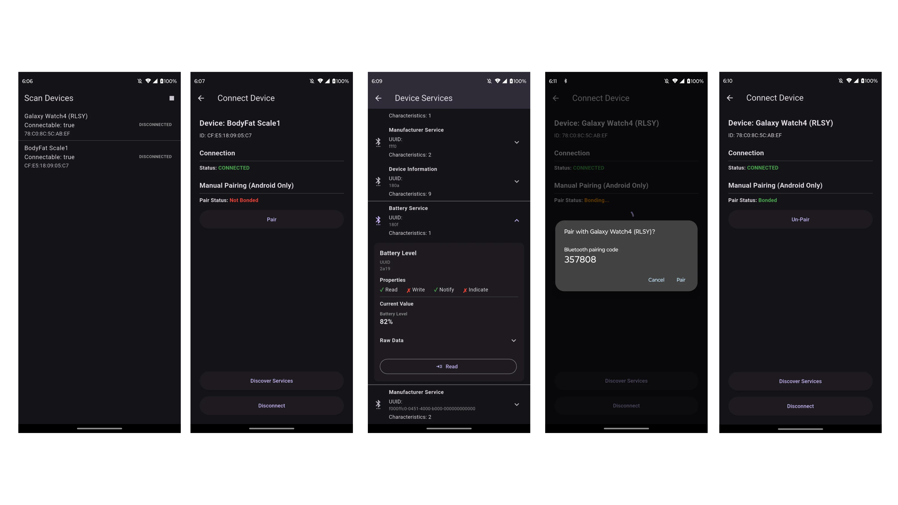
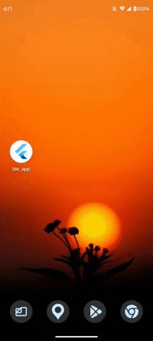

# Flutter BLE Demo

A Flutter Bluetooth Low Energy (BLE) demo application built to explore the complete BLE workflow on Android and iOS. The project focuses on implementing BLE features in a production-oriented manner while keeping the Bluetooth layer modular, reusable, and platform-aware.

The application currently supports:

- Bluetooth permission handling
- BLE device scanning
- Connect / Disconnect
- Pair / Unpair (Native Method Channel)
- Display Connected Device Services
- Display Connected Device Characteristics
- Read Characteristics
- Write Characteristics
- UUID Mapping
- Human-friendly Characteristic Value Decoding

---



### Demo: [download APK here](https://github.com/Jithin-Jude/ble_app/raw/refs/heads/main/demo_apk/BLE-demo-release.apk "Link to release APK")


# Overview

The primary goal of this project was to gain hands-on experience with Bluetooth Low Energy rather than simply integrating a BLE package.

Instead of interacting with FlutterBluePlus directly from the UI, all Bluetooth operations are abstracted behind dedicated managers and repositories, allowing the application to remain independent of the underlying BLE implementation.

During development I explored the complete BLE communication lifecycle, platform-specific limitations, Bluetooth GATT architecture, Android bonding APIs, and Bluetooth SIG specifications.

The application demonstrates the complete BLE communication flow:

```
Bluetooth Permission
        ↓
Scan Devices
        ↓
Connect Device
        ↓
Discover Services
        ↓
Discover Characteristics
        ↓
Read / Write Characteristics
```

Android-specific bonding functionality is implemented natively using Method Channels.

---

# Features

## Android

- BLE Scan
- Connect / Disconnect
- Pair Device
- Unpair Device
- Pair State Detection
- Discover Services
- Discover Characteristics
- Read Characteristics
- Write Characteristics

## iOS

- BLE Scan
- Connect / Disconnect
- Discover Services
- Discover Characteristics
- Read Characteristics
- Write Characteristics

> Pairing is intentionally not implemented on iOS because Apple manages BLE bonding internally and does not expose public APIs for pairing.

---

# Core Components

## BluetoothManager

`BluetoothManager` acts as the single entry point for all BLE operations.

Responsibilities include:

- Bluetooth adapter state
- Device scanning
- Connect / Disconnect
- Discover Services
- Discover Characteristics
- Read Characteristics
- Write Characteristics

The manager wraps FlutterBluePlus and prevents BLE implementation details from leaking into the application layers.

---

## BluetoothBondManager

Android does not expose bonding APIs through FlutterBluePlus.

To support pairing and unpairing, a dedicated `BluetoothBondManager` was introduced using Flutter Method Channels.

Responsibilities include:

- Pair Device
- Unpair Device
- Query Bond State
- Listen for Bond State Changes

Keeping bonding separate from `BluetoothManager` follows the Single Responsibility Principle and keeps platform-specific code isolated.

# Implementation Highlights & Challenges
## Processing BLE Advertisements

One interesting challenge encountered during development was handling BLE advertisement packets.

Some peripherals broadcast multiple advertisements simultaneously, resulting in duplicate scan results for what appears to be the same physical device.

For example, Galaxy Watch 4 may advertise multiple packets using different random MAC addresses and advertising payloads.

To improve the scanning experience, all scan results are processed through `_purifyBluetoothScanResults()`.
```dart
  List<ScanResult> _purifyBluetoothScanResults(List<ScanResult> results) {
    final Map<String, ScanResult> uniqueResults = {};
    final Map<String, String> remoteIdToManufacturerKey = {};

    // First pass: Associate remoteIds with their manufacturer data
    for (var result in results) {
      final mData = result.advertisementData.manufacturerData;
      if (mData.isNotEmpty) {
        remoteIdToManufacturerKey[result.device.remoteId.str] = mData.toString();
      }
    }

    // Second pass: Merge results based on manufacturer data identity
    for (var result in results) {
      final remoteId = result.device.remoteId.str;
      // Use manufacturer data as the primary key, fallback to remoteId
      final String key = remoteIdToManufacturerKey[remoteId] ?? remoteId;

      if (uniqueResults.containsKey(key)) {
        if (result.rssi > uniqueResults[key]!.rssi) {
          uniqueResults[key] = result;
        }
      } else {
        uniqueResults[key] = result;
      }
    }

    final purifiedResults = uniqueResults.values.toList();

    // Sort by RSSI to show strongest signals at the top
    purifiedResults.sort((a, b) => b.rssi.compareTo(a.rssi));

    return purifiedResults;
  }
```

This method:

Filters invalid advertisements
Removes duplicate entries where appropriate
Keeps the latest advertisement data
Produces a cleaner device list for the UI

This significantly improves usability while still preserving useful advertisement information.

## Bluetooth UUID Mapping

BLE Services and Characteristics are identified using UUIDs instead of human-readable names.

Example:
```
180F
2A19
```
Without interpretation these values provide little context.

A reusable BluetoothUuidMapper was implemented to map Bluetooth SIG standard UUIDs into friendly names.

Examples:
```
180F -> Battery Service
```

```
2A19 -> Battery Level
```

Proprietary manufacturer-specific UUIDs are intentionally left unmapped and displayed as:

"Manufacturer Service" and "Manufacturer Characteristic"

while still presenting the raw UUID for inspection.

## Characteristic Value Decoding

Reading a characteristic only returns raw bytes.

For example:


`[51]`


The byte array itself provides very little information. A reusable BluetoothValueFormatter was introduced to decode well-known Bluetooth SIG characteristics into meaningful values.

Example:
```
Battery Level

[51] (Raw Value)

↓

51% (Properly formated)
```
Other standard characteristics such as Device Name, Manufacturer Name and Model Number are decoded into readable strings.

For manufacturer-specific characteristics, the formatter falls back to displaying:

* Hexadecimal
* UTF-8 Text (when valid)
* Raw Bytes

This approach allows the application to work with both Bluetooth SIG standard devices and proprietary BLE peripherals.

## Android Bonding

BLE pairing (bonding) differs significantly between Android and iOS.

Android exposes native APIs that allow applications to:

* Initiate pairing
* Remove existing bonds
* Query bond state
* Listen for bond state changes

These APIs are not available through FlutterBluePlus.

To support bonding, the application uses native Android Method Channels to bridge Flutter with the Android Bluetooth framework.

This implementation also helped reinforce the distinction between:

* Pairing (Bonding)
* Connecting
* Discovering Services
* Accessing GATT Characteristics

which are independent stages within the BLE communication lifecycle.

## Platform Differences

During development several platform-specific BLE differences became apparent.

### Android
* Supports application-controlled pairing
* Bond state can be queried
* Bond state change events are available
* Pairing can be initiated before or after connecting
### iOS
* Pairing is managed entirely by the operating system
* Applications cannot initiate pairing
* Bond state is not exposed
* Pairing dialogs appear automatically only when a protected characteristic requires authentication

Understanding these platform differences was an important part of building a cross-platform BLE application.

# Architecture

The application follows the following flow for each feature:
```
Screen
    ↓
Cubit
    ↓
UseCase
    ↓
Repository
    ↓
DataSource
    ↓
BluetoothManager / BluetoothBondManager
```
This separation keeps Bluetooth-specific implementation isolated from the rest of the application.

# Directory Structure
```
lib
│
├── core
│   ├── bluetooth
│   ├── constants
│   ├── di
│   ├── model
│   ├── presentation
│   ├── provider
│   ├── result
│   ├── theme
│   ├── utils
│   └── widgets
│
├── features
│   └── bluetooth
│       ├── bluetooth_permissions
│       ├── connect_device
│       ├── list_device_services
│       └── scan_devices
│
└── main.dart
```
Each Bluetooth feature follows the same modular structure:
```
feature
│
├── data
│   ├── datasource
│   ├── model
│   └── repository
│
├── domain
│   ├── entity
│   ├── repository
│   └── usecase
│
├── presentation
│   ├── cubit
│   ├── screens
│   └── widgets
│
└── di
```
# References
* [FlutterBluePlus](https://pub.dev/packages/flutter_blue_plus)
* [permission_handler](https://pub.dev/packages/permission_handler)
* [Android Bluetooth Low Energy Documentation](https://developer.android.com/develop/connectivity/bluetooth/ble/ble-overview)
* [Apple CoreBluetooth Documentation](https://developer.apple.com/documentation/corebluetooth/)
* [Bluetooth SIG GATT Specifications](https://btprodspecificationrefs.blob.core.windows.net/gatt-specification-supplement/GATT_Specification_Supplement.pdf)
* [Bluetooth SIG Assigned Numbers](https://www.bluetooth.com/wp-content/uploads/Files/Specification/HTML/Assigned_Numbers/out/en/Assigned_Numbers.pdf)
# Key Learnings

Developing this project provided practical experience with:

* BLE advertisement processing
* Bluetooth GATT architecture
* Service and Characteristic discovery
* Reading and writing GATT characteristics
* Bluetooth SIG standard Services and Characteristics
* Decoding characteristic values based on Bluetooth specifications
* Android bonding APIs (createBond(), removeBond(), ACTION_BOND_STATE_CHANGED)
* Cross-platform BLE differences between Android and iOS
* The distinction between pairing, connecting, service discovery and characteristic access
